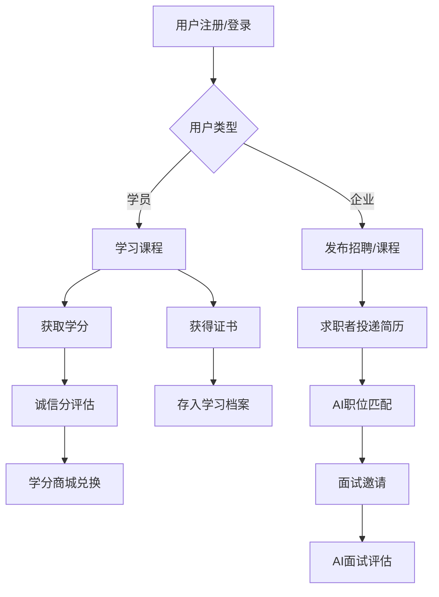
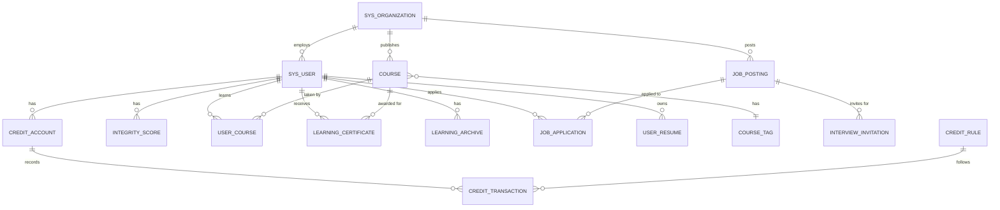

# 星秩存册 · 终身学习学分银行平台 - 数据库设计文档

---

## 1. 数据库概述

### 1.1 类型划分

本系统数据库分为三个主要部分：

| 模块 | 表数量 | 功能描述 |
| :--- | :--- | :--- |
| 认证服务数据库 | 1个 | 提供统一的用户认证和授权功能 |
| 就业系统数据库 | 24个 | 管理就业相关数据，包括学分经济、学习管理、商城、论坛、招聘等 |
| AI面试系统数据库 | 6个 | 管理AI面试、学习画像、智能推荐等相关数据 |

### 1.2 标识符和约定

- **命名规范**：数据库表、字段均采用小写字母加下划线(`_`)的方式命名，力求简洁明了
- **字符集**：`utf8mb4`，支持全角字符和表情符号
- **存储引擎**：`InnoDB`，支持事务和外键约束
- **时间字段**：统一使用 `DATETIME` 类型，默认值为 `CURRENT_TIMESTAMP`
- **逻辑删除**：使用 `deleted` 字段（`TINYINT DEFAULT 0`）实现软删除

---

## 2. 数据库表设计

### 2.1 认证服务数据库

#### 2.1.1 系统用户表（sys_user）

| 字段中文名 | 字段名 | 字段类型 | 不为空 | 主键 | 外键 |
| :--- | :--- | :--- | :--- | :--- | :--- |
| 用户ID | id | bigint | 是 | 是 | 否 |
| 登录用户名 | username | varchar(50) | 是 | 否 | 否 |
| 密码(BCrypt) | password | varchar(255) | 是 | 否 | 否 |
| 真实姓名 | real_name | varchar(50) | 否 | 否 | 否 |
| 手机号 | phone | varchar(20) | 否 | 否 | 否 |
| 邮箱 | email | varchar(100) | 否 | 否 | 否 |
| 头像URL | avatar | varchar(255) | 否 | 否 | 否 |
| 角色: 0学员 1企业用户 2系统管理员 | role | tinyint | 是 | 否 | 否 |
| 所属企业/机构ID | org_id | bigint | 否 | 否 | 是(sys_organization.id) |
| 状态: 0禁用 1正常 | status | tinyint | 否 | 否 | 否 |
| 创建时间 | create_time | datetime | 否 | 否 | 否 |
| 更新时间 | update_time | datetime | 否 | 否 | 否 |
| 删除标记 | deleted | tinyint | 否 | 否 | 否 |

**索引**：
- `idx_user_role (role)`
- `idx_user_org (org_id)`

---

### 2.2 就业系统数据库

#### 2.2.1 加盟机构/企业表（sys_organization）

| 字段中文名 | 字段名 | 字段类型 | 不为空 | 主键 | 外键 |
| :--- | :--- | :--- | :--- | :--- | :--- |
| 机构/企业ID | id | bigint | 是 | 是 | 否 |
| 机构名称 | name | varchar(100) | 是 | 否 | 否 |
| 机构编码 | code | varchar(50) | 是 | 否 | 否 |
| 类型: 1高校 2培训机构 3企业 4其他 | type | tinyint | 是 | 否 | 否 |
| Logo URL | logo | varchar(255) | 否 | 否 | 否 |
| 企业/机构简介 | intro | text | 否 | 否 | 否 |
| 联系人 | contact | varchar(50) | 否 | 否 | 否 |
| 联系电话 | phone | varchar(20) | 否 | 否 | 否 |
| 联系邮箱 | email | varchar(100) | 否 | 否 | 否 |
| 地址 | address | varchar(255) | 否 | 否 | 否 |
| 官网 | website | varchar(255) | 否 | 否 | 否 |
| 加盟状态: 0待审核 1已加盟 2已退出 | join_status | tinyint | 否 | 否 | 否 |
| 状态: 0停用 1正常 | status | tinyint | 否 | 否 | 否 |
| 创建时间 | create_time | datetime | 否 | 否 | 否 |
| 更新时间 | update_time | datetime | 否 | 否 | 否 |
| 删除标记 | deleted | tinyint | 否 | 否 | 否 |

**索引**：
- `idx_org_type (type)`
- `idx_org_status (join_status, status)`

#### 2.2.2 统一标签表（sys_tag）

| 字段中文名 | 字段名 | 字段类型 | 不为空 | 主键 | 外键 |
| :--- | :--- | :--- | :--- | :--- | :--- |
| 标签ID | id | bigint | 是 | 是 | 否 |
| 标签名: Java/C++等 | name | varchar(50) | 是 | 否 | 否 |
| 分类: skill/course/job/general | category | varchar(30) | 否 | 否 | 否 |
| 创建时间 | create_time | datetime | 否 | 否 | 否 |

#### 2.2.3 学分账户表（credit_account）

| 字段中文名 | 字段名 | 字段类型 | 不为空 | 主键 | 外键 |
| :--- | :--- | :--- | :--- | :--- | :--- |
| 账户ID | id | bigint | 是 | 是 | 否 |
| 用户ID | user_id | bigint | 是 | 否 | 是(sys_user.id) |
| 当前学分余额 | balance | decimal(12,2) | 是 | 否 | 否 |
| 累计获取 | total_earned | decimal(12,2) | 是 | 否 | 否 |
| 累计消耗 | total_spent | decimal(12,2) | 是 | 否 | 否 |
| 创建时间 | create_time | datetime | 否 | 否 | 否 |
| 更新时间 | update_time | datetime | 否 | 否 | 否 |

#### 2.2.4 学分规则配置表（credit_rule）

| 字段中文名 | 字段名 | 字段类型 | 不为空 | 主键 | 外键 |
| :--- | :--- | :--- | :--- | :--- | :--- |
| 规则ID | id | bigint | 是 | 是 | 否 |
| 规则编码 | rule_code | varchar(50) | 是 | 否 | 否 |
| 规则名称 | rule_name | varchar(100) | 是 | 否 | 否 |
| 学分变动值 | amount | decimal(10,2) | 是 | 否 | 否 |
| 业务类型 | biz_type | varchar(50) | 是 | 否 | 否 |
| 说明 | description | varchar(255) | 否 | 否 | 否 |
| 是否启用 | enabled | tinyint | 否 | 否 | 否 |
| 创建时间 | create_time | datetime | 否 | 否 | 否 |

#### 2.2.5 学分流水表（credit_transaction）

| 字段中文名 | 字段名 | 字段类型 | 不为空 | 主键 | 外键 |
| :--- | :--- | :--- | :--- | :--- | :--- |
| 流水ID | id | bigint | 是 | 是 | 否 |
| 用户ID | user_id | bigint | 是 | 否 | 是(sys_user.id) |
| 类型: 1获取 2转换 3增长 4消耗 | type | tinyint | 是 | 否 | 否 |
| 变动学分 | amount | decimal(12,2) | 是 | 否 | 否 |
| 变动后余额 | balance_after | decimal(12,2) | 否 | 否 | 否 |
| 业务类型 | biz_type | varchar(50) | 否 | 否 | 否 |
| 来源/用途说明 | source | varchar(200) | 否 | 否 | 否 |
| 关联业务表类型 | ref_type | varchar(50) | 否 | 否 | 否 |
| 关联业务ID | ref_id | bigint | 否 | 否 | 否 |
| 创建时间 | create_time | datetime | 否 | 否 | 否 |

**索引**：
- `idx_credit_user (user_id)`
- `idx_credit_biz (biz_type, ref_type, ref_id)`
- `idx_credit_time (create_time)`

#### 2.2.6 用户当前诚信分表（integrity_score）

| 字段中文名 | 字段名 | 字段类型 | 不为空 | 主键 | 外键 |
| :--- | :--- | :--- | :--- | :--- | :--- |
| 用户ID | user_id | bigint | 是 | 是 | 是(sys_user.id) |
| 当前诚信分(0-100) | score | int | 是 | 否 | 否 |
| 更新时间 | update_time | datetime | 否 | 否 | 否 |

#### 2.2.7 诚信评定记录表（integrity_record）

| 字段中文名 | 字段名 | 字段类型 | 不为空 | 主键 | 外键 |
| :--- | :--- | :--- | :--- | :--- | :--- |
| 记录ID | id | bigint | 是 | 是 | 否 |
| 用户ID | user_id | bigint | 是 | 否 | 是(sys_user.id) |
| 变动分值(正负) | change_value | int | 是 | 否 | 否 |
| 变动后分数 | score_after | int | 是 | 否 | 否 |
| 1加分 2扣分 | event_type | tinyint | 是 | 否 | 否 |
| 原因 | reason | varchar(255) | 是 | 否 | 否 |
| 关联业务 | ref_type | varchar(50) | 否 | 否 | 否 |
| 关联ID | ref_id | bigint | 否 | 否 | 否 |
| 操作人 | operator_id | bigint | 否 | 否 | 是(sys_user.id) |
| 创建时间 | create_time | datetime | 否 | 否 | 否 |

**索引**：
- `idx_integrity_user (user_id)`
- `idx_integrity_time (create_time)`

#### 2.2.8 学习资源/课程表（course）

| 字段中文名 | 字段名 | 字段类型 | 不为空 | 主键 | 外键 |
| :--- | :--- | :--- | :--- | :--- | :--- |
| 课程ID | id | bigint | 是 | 是 | 否 |
| 发布机构/企业ID | org_id | bigint | 否 | 否 | 是(sys_organization.id) |
| 发布人用户ID | publisher_id | bigint | 否 | 否 | 是(sys_user.id) |
| 课程标题 | title | varchar(200) | 是 | 否 | 否 |
| 课程描述 | description | text | 否 | 否 | 否 |
| 封面 | cover_url | varchar(255) | 否 | 否 | 否 |
| 课程视频播放地址 | video_url | varchar(1000) | 否 | 否 | 否 |
| 视频时长(秒) | video_duration_seconds | int | 否 | 否 | 否 |
| 学分定价 | price_credit | decimal(10,2) | 否 | 否 | 否 |
| 现金定价 | price_money | decimal(10,2) | 否 | 否 | 否 |
| 学时 | duration_hours | decimal(6,1) | 否 | 否 | 否 |
| 完成奖励学分 | credit_reward | decimal(10,2) | 否 | 否 | 否 |
| 0下架 1上架 | status | tinyint | 否 | 否 | 否 |
| 创建时间 | create_time | datetime | 否 | 否 | 否 |
| 更新时间 | update_time | datetime | 否 | 否 | 否 |
| 删除标记 | deleted | tinyint | 否 | 否 | 否 |

**索引**：
- `idx_course_org (org_id)`
- `idx_course_status (status)`

#### 2.2.9 课程标签关联表（course_tag）

| 字段中文名 | 字段名 | 字段类型 | 不为空 | 主键 | 外键 |
| :--- | :--- | :--- | :--- | :--- | :--- |
| 课程ID | course_id | bigint | 是 | 是 | 是(course.id) |
| 标签ID | tag_id | bigint | 是 | 是 | 是(sys_tag.id) |

**索引**：
- `idx_ct_tag (tag_id)`

#### 2.2.10 用户课程学习记录表（user_course）

| 字段中文名 | 字段名 | 字段类型 | 不为空 | 主键 | 外键 |
| :--- | :--- | :--- | :--- | :--- | :--- |
| 学习记录ID | id | bigint | 是 | 是 | 否 |
| 学员ID | user_id | bigint | 是 | 否 | 是(sys_user.id) |
| 课程ID | course_id | bigint | 是 | 否 | 是(course.id) |
| 进度0-100 | progress | tinyint | 否 | 否 | 否 |
| 累计实际观看秒数 | watched_seconds | int | 否 | 否 | 否 |
| 最远观看位置(秒) | max_watched_position_seconds | int | 否 | 否 | 否 |
| 最后播放位置(秒) | last_position_seconds | int | 否 | 否 | 否 |
| 0学习中 1已完成 2已退课 | status | tinyint | 否 | 否 | 否 |
| 消耗学分 | paid_credit | decimal(10,2) | 否 | 否 | 否 |
| 开始时间 | start_time | datetime | 否 | 否 | 否 |
| 完成时间 | complete_time | datetime | 否 | 否 | 否 |

**索引**：
- `uk_user_course (user_id, course_id)`
- `idx_uc_course (course_id)`
- `idx_uc_status (status)`

#### 2.2.11 学习证书表（learning_certificate）

| 字段中文名 | 字段名 | 字段类型 | 不为空 | 主键 | 外键 |
| :--- | :--- | :--- | :--- | :--- | :--- |
| 证书ID | id | bigint | 是 | 是 | 否 |
| 证书唯一编号 | cert_no | varchar(64) | 是 | 否 | 否 |
| 学员ID | user_id | bigint | 是 | 否 | 是(sys_user.id) |
| 关联课程ID | course_id | bigint | 否 | 否 | 是(course.id) |
| 证书名称 | title | varchar(200) | 是 | 否 | 否 |
| 二维码内容 | qr_content | varchar(500) | 是 | 否 | 否 |
| 二维码图片 | qr_image_url | varchar(255) | 否 | 否 | 否 |
| 证书PDF下载地址 | file_url | varchar(255) | 否 | 否 | 否 |
| 区块链存证哈希 | blockchain_hash | varchar(128) | 否 | 否 | 否 |
| 0待校验 1已通过 2未通过 | verify_status | tinyint | 否 | 否 | 否 |
| 颁发时间 | issued_at | datetime | 否 | 否 | 否 |

**索引**：
- `idx_cert_user (user_id)`
- `idx_cert_course (course_id)`

#### 2.2.12 终身学习档案表（learning_archive）

| 字段中文名 | 字段名 | 字段类型 | 不为空 | 主键 | 外键 |
| :--- | :--- | :--- | :--- | :--- | :--- |
| 档案ID | id | bigint | 是 | 是 | 否 |
| 用户ID | user_id | bigint | 是 | 否 | 是(sys_user.id) |
| 档案标题 | title | varchar(200) | 是 | 否 | 否 |
| 1课程 2活动 3成果 4其他 | archive_type | tinyint | 否 | 否 | 否 |
| 关联课程 | course_id | bigint | 否 | 否 | 是(course.id) |
| 关联证书 | certificate_id | bigint | 否 | 否 | 是(learning_certificate.id) |
| 类别 | category | varchar(50) | 否 | 否 | 否 |
| 描述 | description | text | 否 | 否 | 否 |
| 开始日期 | start_date | date | 否 | 否 | 否 |
| 结束日期 | end_date | date | 否 | 否 | 否 |
| 获得学分 | credit_earned | decimal(10,2) | 否 | 否 | 否 |
| 0进行中 1已完成 | status | tinyint | 否 | 否 | 否 |
| 创建时间 | create_time | datetime | 否 | 否 | 否 |
| 更新时间 | update_time | datetime | 否 | 否 | 否 |
| 删除标记 | deleted | tinyint | 否 | 否 | 否 |

**索引**：
- `idx_archive_user (user_id)`
- `idx_archive_type (archive_type)`

#### 2.2.13 学习成果表（learning_achievement）

| 字段中文名 | 字段名 | 字段类型 | 不为空 | 主键 | 外键 |
| :--- | :--- | :--- | :--- | :--- | :--- |
| 成果ID | id | bigint | 是 | 是 | 否 |
| 用户ID | user_id | bigint | 是 | 否 | 是(sys_user.id) |
| 成果名称 | title | varchar(200) | 是 | 否 | 否 |
| 1证书 2课程 3项目 4其他 | type | tinyint | 否 | 否 | 否 |
| 认证机构 | org_id | bigint | 否 | 否 | 是(sys_organization.id) |
| 关联证书 | certificate_id | bigint | 否 | 否 | 是(learning_certificate.id) |
| 可兑换学分 | credit_value | decimal(10,2) | 否 | 否 | 否 |
| 附件 | file_url | varchar(255) | 否 | 否 | 否 |
| 0待校验 1已通过 2未通过 | verify_status | tinyint | 否 | 否 | 否 |
| 存证哈希 | blockchain_hash | varchar(128) | 否 | 否 | 否 |
| 创建时间 | create_time | datetime | 否 | 否 | 否 |
| 更新时间 | update_time | datetime | 否 | 否 | 否 |
| 删除标记 | deleted | tinyint | 否 | 否 | 否 |

**索引**：
- `idx_achievement_user (user_id)`

#### 2.2.14 每日学习统计表（learning_stat_daily）

| 字段中文名 | 字段名 | 字段类型 | 不为空 | 主键 | 外键 |
| :--- | :--- | :--- | :--- | :--- | :--- |
| ID | id | bigint | 是 | 是 | 否 |
| 用户ID | user_id | bigint | 是 | 否 | 是(sys_user.id) |
| 统计日期 | stat_date | date | 是 | 否 | 否 |
| 学习时长(分钟) | study_minutes | int | 否 | 否 | 否 |
| 完成课程数 | courses_completed | int | 否 | 否 | 否 |
| 当日获得学分 | credit_earned | decimal(10,2) | 否 | 否 | 否 |

**索引**：
- `uk_user_date (user_id, stat_date)`
- `idx_stat_date (stat_date)`

#### 2.2.15 商城分类表（mall_category）

| 字段中文名 | 字段名 | 字段类型 | 不为空 | 主键 | 外键 |
| :--- | :--- | :--- | :--- | :--- | :--- |
| 分类ID | id | bigint | 是 | 是 | 否 |
| 分类名称 | name | varchar(100) | 是 | 否 | 否 |
| 父分类ID | parent_id | bigint | 否 | 否 | 是(mall_category.id) |
| 排序 | sort_order | int | 否 | 否 | 否 |
| 状态 | status | tinyint | 否 | 否 | 否 |
| 创建时间 | create_time | datetime | 否 | 否 | 否 |

**索引**：
- `idx_mall_cat_parent (parent_id)`

#### 2.2.16 商城商品表（mall_product）

| 字段中文名 | 字段名 | 字段类型 | 不为空 | 主键 | 外键 |
| :--- | :--- | :--- | :--- | :--- | :--- |
| 商品ID | id | bigint | 是 | 是 | 否 |
| 分类ID | category_id | bigint | 是 | 否 | 是(mall_category.id) |
| 商品名称 | name | varchar(200) | 是 | 否 | 否 |
| 描述 | description | text | 否 | 否 | 否 |
| 封面 | cover_url | varchar(255) | 否 | 否 | 否 |
| 1实物 2虚拟 3课程 4服务 | product_type | tinyint | 否 | 否 | 否 |
| 关联课程 | ref_course_id | bigint | 否 | 否 | 是(course.id) |
| 学分价格 | price_credit | decimal(10,2) | 否 | 否 | 否 |
| 现金价格 | price_money | decimal(10,2) | 否 | 否 | 否 |
| 库存 | stock | int | 否 | 否 | 否 |
| 0下架 1上架 | status | tinyint | 否 | 否 | 否 |
| 创建时间 | create_time | datetime | 否 | 否 | 否 |
| 更新时间 | update_time | datetime | 否 | 否 | 否 |
| 删除标记 | deleted | tinyint | 否 | 否 | 否 |

**索引**：
- `idx_product_cat (category_id)`
- `idx_product_type (product_type)`

#### 2.2.17 商城订单表（mall_order）

| 字段中文名 | 字段名 | 字段类型 | 不为空 | 主键 | 外键 |
| :--- | :--- | :--- | :--- | :--- | :--- |
| 订单ID | id | bigint | 是 | 是 | 否 |
| 订单号 | order_no | varchar(32) | 是 | 否 | 否 |
| 买家ID | user_id | bigint | 是 | 否 | 是(sys_user.id) |
| 学分总额 | total_credit | decimal(12,2) | 否 | 否 | 否 |
| 现金总额 | total_money | decimal(12,2) | 否 | 否 | 否 |
| 1学分 2模拟支付 3混合 | pay_method | tinyint | 否 | 否 | 否 |
| 0待支付 1已支付 2已取消 3已退款 | pay_status | tinyint | 否 | 否 | 否 |
| 支付时间 | pay_time | datetime | 否 | 否 | 否 |
| 备注 | remark | varchar(255) | 否 | 否 | 否 |
| 创建时间 | create_time | datetime | 否 | 否 | 否 |
| 更新时间 | update_time | datetime | 否 | 否 | 否 |

**索引**：
- `idx_order_user (user_id)`
- `idx_order_status (pay_status)`

#### 2.2.18 订单明细表（mall_order_item）

| 字段中文名 | 字段名 | 字段类型 | 不为空 | 主键 | 外键 |
| :--- | :--- | :--- | :--- | :--- | :--- |
| 明细ID | id | bigint | 是 | 是 | 否 |
| 订单ID | order_id | bigint | 是 | 否 | 是(mall_order.id) |
| 商品ID | product_id | bigint | 是 | 否 | 是(mall_product.id) |
| 商品快照名 | product_name | varchar(200) | 否 | 否 | 否 |
| 数量 | quantity | int | 是 | 否 | 否 |
| 学分价格 | price_credit | decimal(10,2) | 否 | 否 | 否 |
| 现金价格 | price_money | decimal(10,2) | 否 | 否 | 否 |
| 兑换码 | redemption_code | varchar(64) | 否 | 否 | 否 |

**索引**：
- `idx_order_item_order (order_id)`

#### 2.2.19 支付记录表（payment_record）

| 字段中文名 | 字段名 | 字段类型 | 不为空 | 主键 | 外键 |
| :--- | :--- | :--- | :--- | :--- | :--- |
| 支付记录ID | id | bigint | 是 | 是 | 否 |
| 订单ID | order_id | bigint | 是 | 否 | 是(mall_order.id) |
| 用户ID | user_id | bigint | 是 | 否 | 是(sys_user.id) |
| 支付流水号 | pay_no | varchar(64) | 是 | 否 | 否 |
| 学分金额 | amount_credit | decimal(12,2) | 否 | 否 | 否 |
| 现金金额 | amount_money | decimal(12,2) | 否 | 否 | 否 |
| 支付渠道 | pay_channel | varchar(30) | 否 | 否 | 否 |
| 1成功 0失败 | pay_status | tinyint | 否 | 否 | 否 |
| 创建时间 | create_time | datetime | 否 | 否 | 否 |

**索引**：
- `idx_pay_order (order_id)`

#### 2.2.20 招聘信息表（job_posting）

| 字段中文名 | 字段名 | 字段类型 | 不为空 | 主键 | 外键 |
| :--- | :--- | :--- | :--- | :--- | :--- |
| 招聘ID | id | bigint | 是 | 是 | 否 |
| 发布企业ID | org_id | bigint | 是 | 否 | 是(sys_organization.id) |
| 发布人 | publisher_id | bigint | 是 | 否 | 是(sys_user.id) |
| 职位名称 | title | varchar(200) | 是 | 否 | 否 |
| 职位描述 | description | text | 否 | 否 | 否 |
| 任职要求 | requirements | text | 否 | 否 | 否 |
| 薪资范围 | salary_range | varchar(50) | 否 | 否 | 否 |
| 工作地点 | location | varchar(100) | 否 | 否 | 否 |
| 学历要求 | edu_requirement | varchar(50) | 否 | 否 | 否 |
| 0下架 1招聘中 | status | tinyint | 否 | 否 | 否 |
| 浏览次数 | view_count | int | 否 | 否 | 否 |
| 创建时间 | create_time | datetime | 否 | 否 | 否 |
| 更新时间 | update_time | datetime | 否 | 否 | 否 |
| 删除标记 | deleted | tinyint | 否 | 否 | 否 |

**索引**：
- `idx_job_org (org_id)`
- `idx_job_status (status)`

#### 2.2.21 招聘技能标签表（job_tag）

| 字段中文名 | 字段名 | 字段类型 | 不为空 | 主键 | 外键 |
| :--- | :--- | :--- | :--- | :--- | :--- |
| 招聘ID | job_id | bigint | 是 | 是 | 是(job_posting.id) |
| 技能标签ID | tag_id | bigint | 是 | 是 | 是(sys_tag.id) |

**索引**：
- `idx_jt_tag (tag_id)`

#### 2.2.22 简历投递表（job_application）

| 字段中文名 | 字段名 | 字段类型 | 不为空 | 主键 | 外键 |
| :--- | :--- | :--- | :--- | :--- | :--- |
| 投递ID | id | bigint | 是 | 是 | 否 |
| 招聘ID | job_id | bigint | 是 | 否 | 是(job_posting.id) |
| 求职者ID | user_id | bigint | 是 | 否 | 是(sys_user.id) |
| 使用的简历ID | resume_id | bigint | 否 | 否 | 是(user_resume.id) |
| 求职信 | cover_message | text | 否 | 否 | 否 |
| 0已投递 1已查看 2面试中 3录用 4拒绝 | status | tinyint | 否 | 否 | 否 |
| 创建时间 | create_time | datetime | 否 | 否 | 否 |
| 更新时间 | update_time | datetime | 否 | 否 | 否 |

**索引**：
- `uk_job_user (job_id, user_id)`
- `idx_apply_user (user_id)`

#### 2.2.23 活动信息表（activity）

| 字段中文名 | 字段名 | 字段类型 | 不为空 | 主键 | 外键 |
| :--- | :--- | :--- | :--- | :--- | :--- |
| 活动ID | id | bigint | 是 | 是 | 否 |
| 主办企业/机构 | org_id | bigint | 是 | 否 | 是(sys_organization.id) |
| 发布人 | publisher_id | bigint | 是 | 否 | 是(sys_user.id) |
| 活动名称 | title | varchar(200) | 是 | 否 | 否 |
| 活动详情 | description | text | 否 | 否 | 否 |
| 地点 | location | varchar(255) | 否 | 否 | 否 |
| 开始时间 | start_time | datetime | 否 | 否 | 否 |
| 结束时间 | end_time | datetime | 否 | 否 | 否 |
| 人数上限 | max_participants | int | 否 | 否 | 否 |
| 参与奖励学分 | credit_reward | decimal(10,2) | 否 | 否 | 否 |
| 0取消 1报名中 2进行中 3已结束 | status | tinyint | 否 | 否 | 否 |
| 创建时间 | create_time | datetime | 否 | 否 | 否 |
| 更新时间 | update_time | datetime | 否 | 否 | 否 |
| 删除标记 | deleted | tinyint | 否 | 否 | 否 |

**索引**：
- `idx_activity_org (org_id)`
- `idx_activity_time (start_time)`

#### 2.2.24 用户简历表（user_resume）

| 字段中文名 | 字段名 | 字段类型 | 不为空 | 主键 | 外键 |
| :--- | :--- | :--- | :--- | :--- | :--- |
| 简历ID | id | bigint | 是 | 是 | 否 |
| 用户ID | user_id | bigint | 是 | 否 | 是(sys_user.id) |
| 简历名称 | title | varchar(100) | 否 | 否 | 否 |
| 结构化简历(JSON) | content_json | json | 否 | 否 | 否 |
| 导出文件URL | file_url | varchar(255) | 否 | 否 | 否 |
| 是否默认 | is_default | tinyint | 否 | 否 | 否 |
| 版本号 | version | int | 否 | 否 | 否 |
| 创建时间 | create_time | datetime | 否 | 否 | 否 |
| 更新时间 | update_time | datetime | 否 | 否 | 否 |

**索引**：
- `idx_resume_user (user_id)`

---

### 2.3 AI面试系统数据库

#### 2.3.1 AI学习画像表（user_learning_profile）

| 字段中文名 | 字段名 | 字段类型 | 不为空 | 主键 | 外键 |
| :--- | :--- | :--- | :--- | :--- | :--- |
| 用户ID | user_id | bigint | 是 | 是 | 是(sys_user.id) |
| 心仪职位 | target_job | varchar(100) | 否 | 否 | 否 |
| 学习画像摘要 | summary | text | 否 | 否 | 否 |
| 画像详情(JSON) | profile_json | json | 否 | 否 | 否 |
| 更新时间 | update_time | datetime | 否 | 否 | 否 |

#### 2.3.2 用户目标技能表（user_target_tag）

| 字段中文名 | 字段名 | 字段类型 | 不为空 | 主键 | 外键 |
| :--- | :--- | :--- | :--- | :--- | :--- |
| 用户ID | user_id | bigint | 是 | 是 | 是(sys_user.id) |
| 目标技能标签 | tag_id | bigint | 是 | 是 | 是(sys_tag.id) |
| manual/job/ai | source | varchar(30) | 否 | 否 | 否 |

#### 2.3.3 职位契合度推荐记录表（job_match_record）

| 字段中文名 | 字段名 | 字段类型 | 不为空 | 主键 | 外键 |
| :--- | :--- | :--- | :--- | :--- | :--- |
| ID | id | bigint | 是 | 是 | 否 |
| 学员ID | user_id | bigint | 是 | 否 | 是(sys_user.id) |
| 职位ID | job_id | bigint | 是 | 否 | 是(job_posting.id) |
| 契合度0-100 | match_score | decimal(5,2) | 是 | 否 | 否 |
| 匹配详情 | match_detail | json | 否 | 否 | 否 |
| 创建时间 | create_time | datetime | 否 | 否 | 否 |

**索引**：
- `idx_match_user (user_id)`
- `idx_match_job (job_id)`

#### 2.3.4 面试邀请表（interview_invitation）

| 字段中文名 | 字段名 | 字段类型 | 不为空 | 主键 | 外键 |
| :--- | :--- | :--- | :--- | :--- | :--- |
| 邀请ID | id | bigint | 是 | 是 | 否 |
| 招聘ID | job_id | bigint | 是 | 否 | 是(job_posting.id) |
| 企业ID | org_id | bigint | 是 | 否 | 是(sys_organization.id) |
| 企业发送人 | from_user_id | bigint | 是 | 否 | 是(sys_user.id) |
| 受邀学员 | to_user_id | bigint | 是 | 否 | 是(sys_user.id) |
| 关联私信ID | message_id | bigint | 否 | 否 | 是(user_message.id) |
| 关联投递ID | application_id | bigint | 否 | 否 | 是(job_application.id) |
| 0待回复 1已接受 2已拒绝 | status | tinyint | 否 | 否 | 否 |
| 面试时间 | invite_time | datetime | 否 | 否 | 否 |
| 面试地点/方式 | location | varchar(255) | 否 | 否 | 否 |
| 0现场 1视频 | interview_mode | tinyint | 是 | 否 | 否 |
| TRTC房间号 | room_id | varchar(64) | 否 | 否 | 否 |
| 创建时间 | create_time | datetime | 否 | 否 | 否 |

**索引**：
- `idx_invite_to (to_user_id)`
- `idx_invite_job (job_id)`

#### 2.3.5 搜索日志表（search_log）

| 字段中文名 | 字段名 | 字段类型 | 不为空 | 主键 | 外键 |
| :--- | :--- | :--- | :--- | :--- | :--- |
| ID | id | bigint | 是 | 是 | 否 |
| 用户ID | user_id | bigint | 否 | 否 | 是(sys_user.id) |
| 搜索词 | keyword | varchar(200) | 是 | 否 | 否 |
| global/course/job/forum | search_type | varchar(30) | 否 | 否 | 否 |
| 结果数量 | result_count | int | 否 | 否 | 否 |
| 创建时间 | create_time | datetime | 否 | 否 | 否 |

**索引**：
- `idx_search_keyword (keyword)`
- `idx_search_user (user_id)`

#### 2.3.6 AI推荐记录表（ai_recommend_log）

| 字段中文名 | 字段名 | 字段类型 | 不为空 | 主键 | 外键 |
| :--- | :--- | :--- | :--- | :--- | :--- |
| ID | id | bigint | 是 | 是 | 否 |
| 用户ID | user_id | bigint | 是 | 否 | 是(sys_user.id) |
| course/job/learning_path | recommend_type | varchar(50) | 是 | 否 | 否 |
| 输入上下文 | input_context | json | 否 | 否 | 否 |
| 推荐结果 | output_result | json | 否 | 否 | 否 |
| 创建时间 | create_time | datetime | 否 | 否 | 否 |

**索引**：
- `idx_ai_rec_user (user_id)`

---

## 3. 附录

### 3.1 表数量统计

| 模块 | 表数量 |
| :--- | :--- |
| 认证服务数据库 | 1 |
| 就业系统数据库 | 24 |
| AI面试系统数据库 | 6 |
| **总计** | **31** |

### 3.2 核心业务流程图

### 3.3 数据库ER图（简化）

---

**文档版本**：v1.0  
**生成日期**：2026-07-16  
**对应分支**：dev/jyw